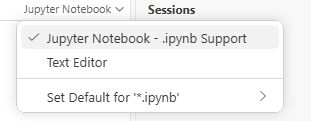
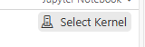
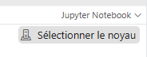
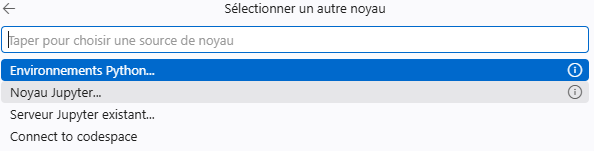
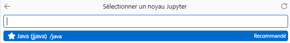

# Cours-java-interactif

## Sommaire

- [Qu'est-ce que Codespaces ?](#quest-ce-que-codespaces-)
- [Lancement d'un cours](#lancemant-dun-cours)
- [Utiliser le cours](#utiliser-le-cours)
- [Mise à jour du cours](#mise-a-jour-du-cours)
- [Arrêter le cours en fin de séance](#arreter-le-cours-en-fin-de-seance)


## QU'EST-CE QUE CODESPACES ? 
[Retour Sommaire](#sommaire)

**GitHub Codespaces** est un ordinateur virtuel que GitHub met à votre disposition dans le cloud. Vous y accédez depuis votre navigateur : il n'y a **rien à installer** sur votre machine (ni Java, ni Docker, ni Jupyter).

Quand vous cliquez sur le bouton « Open in Codespaces », GitHub :

1. crée un environnement personnel, avec Java 21 et le kernel Java déjà configurés ;
2. y copie le cours ;
3. ouvre VS Code dans votre navigateur, prêt à exécuter les notebooks.

### À savoir

- **Votre copie est personnelle** : ce que vous modifiez dans votre Codespace n'affecte ni le dépôt du cours, ni les autres étudiants.
- **Il fonctionne avec votre compte GitHub** et utilise votre quota gratuit mensuel, largement suffisant pour ce cours si vous pensez à l'arrêter après chaque séance.
- **Il s'arrête tout seul** après 30 minutes d'inactivité. Vous pouvez le rouvrir depuis [github.com/codespaces](https://github.com/codespaces) en cliquant sur son nom.
- **Il n'est pas éternel** : un Codespace inactif est supprimé au bout d'un certain temps. Pensez à **télécharger vos notebooks** pour en garder une copie.
- **Il faut une connexion internet** : tout fonctionne en ligne.


### Quotas mensuels inclus

| Plan | Calcul | Stockage |
|---|---|---|
| GitHub Free | 120 heures-cœur | 15 Go-mois |
| GitHub Pro | 180 heures-cœur | 20 Go-mois |

#### Sur une machine à 2 cœurs

La documentation indique que le multiplicateur d'usage inclus est de **2** pour une machine 2 cœurs. L'unité est l'**heure-cœur** : une heure d'utilisation sur 2 cœurs consomme donc 2 heures-cœur.

- **Compte Free** : 120 ÷ 2 = environ **60 heures par mois**.
- **Compte Pro** : 180 ÷ 2 = environ **90 heures par mois**.


## LANCEMANT D'UN COURS
[Retour Sommaire](#sommaire)

Pour lancer ce cours, voud devez avoir un compte GitTHub. Vous pouvez bénéficier d'un compte étudiant avec plus de fonctionnalité ouverte qu'un compte GitHub Free.

Si vous possédez un compte, cliquez sur ce lien pour ouvrir le **codeSpace**:   
[](https://codespaces.new/samuelgibert/Cours-java-interactif)

Le codespace va être créer (cloner) à partir du dépot **samuelgibert/Cours-Java-Interacif**.  Laisser les options par defaut. Si vous modifier le type de machine vous consommerai plus. Terminer en cliquant sur ```Créer un espace de code```  : 

Votre machine virtuel s'ouvre dans votre navigateur (l'ouverture peut prendre quelques minutes), dans une page web dédié avec une instance de vscode: 

Pour visualiser le cours correctement choisir l'option ```Jupyter NoteBook``` en haut à droite


Si le kernel (noyau) Java ne se lance pas automatiquement le modifier dans  ou en français 

Dans Sélectionner un noyau prendre Noyau Jupyter 

puis sélectionnez le noyau java : 


## UTILISER LE COURS
[Retour Sommaire](#sommaire)
### 1. Travailler sur une copie

**Ne travaillez pas directement sur le notebook d'origine.** Faites-en une copie et annotez, modifiez et testez dedans :

1. Dans l'explorateur de fichiers (colonne de gauche), faites un clic droit sur le notebook, puis **Copy**.
2. Faites un clic droit dans une zone vide de l'explorateur, puis **Paste**. Une copie apparaît, par exemple `Cours3_Les_bases_JAVA copy.ipynb`.
3. Renommez-la : clic droit, **Rename** (ou touche `F2`), par exemple `Cours3_perso.ipynb`.
4. Ouvrez votre copie et travaillez dedans.

Vous gardez ainsi l'original intact, ce qui permet de repartir de zéro en cas d'erreur et de repérer facilement vos propres fichiers.


### 3. Comprendre un notebook

Un notebook est une suite de **cellules** de deux types :

- **cellules de texte** (Markdown) : le cours, les explications ;
- **cellules de code** (Java) : des exemples que vous pouvez **exécuter et modifier**.

### 4. Exécuter une cellule

Cliquez dans une cellule de code, puis :

- `Shift + Entrée` : exécute la cellule et passe à la suivante ;
- `Ctrl + Entrée` : exécute la cellule et reste dessus ;
- ou cliquez sur le bouton **▶** à gauche de la cellule.

Le résultat s'affiche juste en dessous. Pendant l'exécution, un indicateur tourne à gauche de la cellule.

> **La première exécution est plus lente** : le kernel démarre. Les suivantes sont rapides.

### 5. Exécuter les cellules dans l'ordre

Les cellules partagent leur mémoire : une variable déclarée dans une cellule reste utilisable dans les suivantes.

```java
int a = 10;
```

```java
System.out.println(a);   // affiche 10 car a a été déclarée plus haut
```

Si vous obtenez une erreur du type « cannot find symbol » (symbole introuvable), vous avez probablement **sauté** la cellule qui déclare la variable. Exécutez les cellules **de haut en bas**, ou utilisez **Run All** (barre d'outils du notebook) pour tout relancer dans l'ordre.

> **Astuce** : avec une méthode `main`, la cellule se contente de la **définir**. Pour l'exécuter, ajoutez l'appel `main(new String[0]);` à la fin de la cellule.

### 6. Modifier et expérimenter

Vous pouvez modifier le code de n'importe quelle cellule et la ré-exécuter. C'est le but du cours : essayez, cassez, corrigez.

- **Ajouter une cellule** : passez la souris entre deux cellules, puis **+ Code** ou **+ Markdown** (pour vos notes).
- **Supprimer une cellule** : cliquez sur l'icône de corbeille à droite de la cellule.
- **Effacer les résultats** : **Clear All Outputs** dans la barre d'outils.

### 7. Quand ça ne répond plus

- Une cellule tourne sans fin (boucle infinie) : cliquez sur **Interrupt** dans la barre d'outils.
- Le comportement est incohérent, ou vous avez modifié une variable par erreur : cliquez sur **Restart**. La mémoire est effacée, relancez les cellules depuis le début.

### 8. Enregistrer son travail

- `Ctrl + S` enregistre le notebook dans votre Codespace.
- Pour garder une copie en dehors du Codespace, **téléchargez-la** : clic droit sur le fichier, puis **Download**.
- Votre travail reste dans le Codespace tant qu'il existe, mais un Codespace inactif finit par être supprimé. Téléchargez donc vos notebooks régulièrement.

## MISE A JOUR DU COURS
[Retour Sommaire](#sommaire)

Quand l'enseignant ajoute un nouveau cours, votre Codespace existant ne le reçoit pas automatiquement. Le plus simple est de **recréer un Codespace neuf**, qui contient toujours la dernière version du cours.

### Étape 1 : sauvegarder votre travail

Téléchargez chaque notebook que vous avez modifié ou annoté : clic droit sur le fichier dans l'explorateur, puis **Download**.

> **Ne sautez pas cette étape.** La suppression d'un Codespace efface définitivement tout ce qu'il contient.

### Étape 2 : supprimer l'ancien Codespace

1. Ouvrez [github.com/codespaces](https://github.com/codespaces).
2. Cliquez sur le menu **...** à droite de votre Codespace.
3. Choisissez **Delete**, puis confirmez.

### Étape 3 : en créer un nouveau

Cliquez de nouveau sur le lien du cours (ou le badge « Open in Codespaces » en haut de cette page), puis sur **Create new codespace**. Attendez la fin du chargement.

### Étape 4 : remettre vos notebooks

Dans le nouveau Codespace, **glissez-déposez** vos notebooks téléchargés dans l'explorateur de fichiers (colonne de gauche). Pour ne pas écraser les versions du cours, donnez-leur un nom différent, par exemple `Cours3_perso.ipynb`.

Ensuite, ouvrez le notebook et vérifiez en haut à droite que le kernel **Java (JJava)** est sélectionné.

### Bon à savoir

- Pensez à **travailler sur une copie** des notebooks (`Cours3_perso.ipynb`) et pas sur l'original : vous saurez toujours quels fichiers sont les vôtres.
- Ne gardez **qu'un seul Codespace** à la fois, pour ne pas consommer votre quota inutilement.
- Quand l'enseignant annonce une mise à jour de l'environnement (Java, kernel), suivez la même procédure.


## ARRETER LE COURS EN FIN DE SEANCE
[Retour Sommaire](#sommaire)

Fermer l'onglet du navigateur **n'arrête pas** votre Codespace : il continue de consommer votre quota jusqu'à son arrêt automatique (après 30 minutes d'inactivité). Pensez à l'arrêter vous-même en fin de séance.

### 1. Sauvegarder votre travail

Avant d'arrêter, **téléchargez votre notebook** : clic droit sur le fichier dans l'explorateur, puis **Download**.

### 2. Arrêter le Codespace

**Depuis GitHub** (le plus simple) :

1. Ouvrez [github.com/codespaces](https://github.com/codespaces).
2. Cliquez sur le menu **...** à droite de votre Codespace.
3. Choisissez **Stop codespace**.

**Depuis VS Code** : `Ctrl+Shift+P`, puis tapez **Codespaces: Stop Current Codespace**.

### 3. Reprendre plus tard

Retournez sur [github.com/codespaces](https://github.com/codespaces) et **cliquez sur le nom** de votre Codespace : il redémarre en quelques secondes, avec vos fichiers.

> **Ne le supprimez pas** (**Delete**) sauf si vous avez téléchargé vos notebooks : la suppression efface tout ce qu'il contient.

